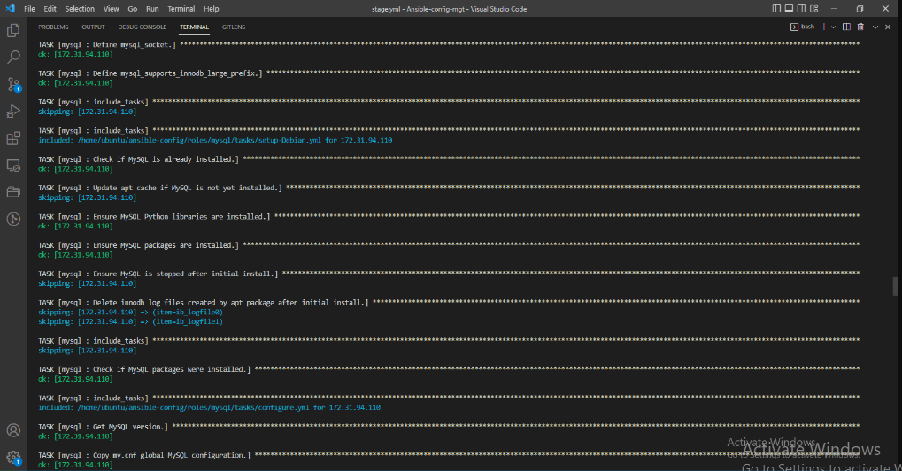

## PECTOR DOCUMENTATION FOR PROJECT 13
- We want to be able to choose which Load Balancer to use, `Nginx` or `Apache`, so we need to have two roles respectively. Install the two roles just the same way we installed mysql.

You can decide to develop new roles or find some in the community. Configiure the two roles respectively, update the neccessary folders and files in other to have a smooth  connection anytime you run the ansible-playbook command.

-
having succesfully installed the two roles, your roles folder output:

 - while the entire repo structure should have the following. Check the images below to compare mine with yours to be sure you are the right track.

 

 

 Load Balancer roles
We want to be able to choose which Load Balancer to use, Nginx or Apache, so we need to have two roles respectively:

Nginx
Apache
Since you cannot use both Nginx and Apache load balancer, you need to add a condition to enable either one – this is where you can make use of variables.

Declare a variable in `defaults/main.yml` file inside the Nginx and Apache roles. Name each variables enable_nginx_lb and enable_apache_lb respectively.

Set both values to false like this enable_nginx_lb: false and enable_apache_lb: false.

Declare another variable in both roles load_balancer_is_required and set its value to false as well

Update both assignment and `site.yml` files respectively

`loadbalancers.yml` file
You will activate load balancer, and enable nginx by setting these in the respective environment’s env-vars file
`enable_nginx_lb: true`
`load_balancer_is_required: true`

Thank You.

